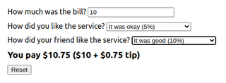
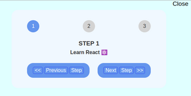
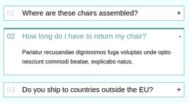
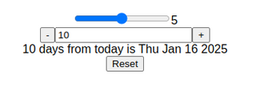
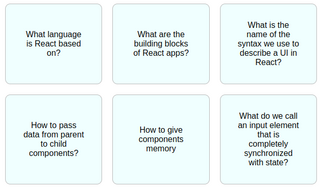
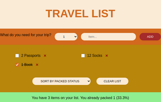
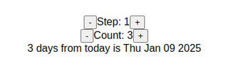
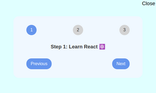

# Frontend Projects

## The Ultimate React Course Projects (reversed order)

#### 6, 7 - State, Events, Forms

| Project                                                                                   | Screenshot                                                |
| ----------------------------------------------------------------------------------------- | --------------------------------------------------------- |
| [Tip Calculator](turc/c06state-events-forms/tip-calculator) - lifting state up            |     |
| [Steps v2](turc/c06state-events-forms/steps) - The children Prop Making a Reusable Button |                   |
| [Accordion](turc/c06state-events-forms/accordion)                                         |           |
| [Date Counter v2](turc/c06state-events-forms/date-counter-2)                              |  |
| [Flashcards](turc/c06state-events-forms/flashcards)                                       |           |
| [Travel List](turc/c06state-events-forms/travel-list)                                     |         |
| [Date Counter v1](turc/c06state-events-forms/date-counter)                                |  |
| [Steps](turc/c06state-events-forms/steps)                                                 |                     |
